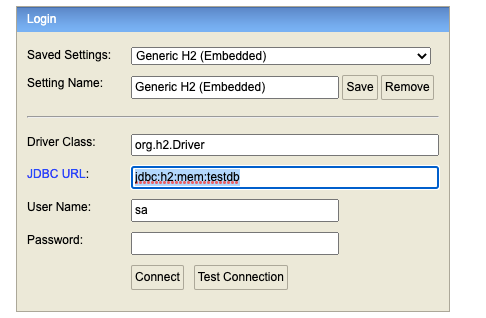

# Reward-Provider
 Reward Provider Backend Application

# Tools and technologies used
* Spring Boot - 2.7.5
* JDK - 11
* Spring Framework - 2.7.5
* Hibernate - 5.2.17. Final
* JPA
* Maven - 3.8.6
* Intellij
* H2 Embedded Database

# Local Setup:

# Prerequisites:

* Fork and clone the [Reward-Provider] (https://github.com/trivedishalini/Reward-Provider.git) project
* Install Intellij
* Install java 11
* Install maven 3.6.3 optional (use link https://www.digitalocean.com/community/tutorials/install-maven-mac-os)
* Install Postman test tool optional

# Steps to Run application from Intellij Editor:
* Reload dependencies by right click on pom.xml
* Then spring boot application has an entry point Java class called RewardProviderApplication.java with the public static void main(String[] args) method, which you can run to start the application.

# Steps to Run application from Terminal or Command Prompt:
* Go to the folder where Reward-Provider repository cloned from terminal
* To reload project dependencies ,execute command "mvn clean install" (Install maven first using link provided above)
* To run application ,execute command "mvn spring-boot:run"

# Steps to Test application from postman:
* Either run **SpringRestClientDataFeeder** class to feed customer and order data in database or call below end points from **postman tool**
* **Create customer** using POST@http://localhost:8080/api/v1/customer
    * And below json request for create customer    
      {
      "emailId": "admin@gmail.com",
      "firstName": "admin",
      "lastName": "admin"
      }
* **Create order detail** using POST@http://localhost:8080/api/v1/customer/{customer_Id}/order
    * And replace customer_id with valid number in end point
    * And below json request for create order details   
      {
      "totalPurchase": 120.67,
      "created": "2022-07-09T18:07:45.547+00:00"
       }
* **Fetch reward point** using GET@http://localhost:8080/api/v1/rewards/{customerId}?fromMonth={fromMonth}
   * And replace customer_id with valid number in end point
   * And replace QueryParams=fromMonth with valid number(1,2,3 etc) in end point from which month reward point need to calculate
  
* **Get All customer** using GET@http://localhost:8080/api/v1/customer
* **Get specific customer** using GET@http://localhost:8080/api/v1/customer/{customer_id}
* **Update customer** using PUT@http://localhost:8080/api/v1/customer/{customer_id}
* **Delete customer** using DELETE@http://localhost:8080/api/v1/customer/{customer_id}

# Steps to access h2 database from browser:
* Run application then access http://localhost:8080/h2-console from browser
   * provide image below details  
  